<h1 align="center">
     
    Rich Black - VS Code Theme
      
    
      
</h1>

<h4 align="center">
    Rich Black is a dark theme with a rich black background and beautiful soft colors for easy readability.
</h3>
 

    &nbsp;
    &nbsp;
    

 
 

## Demo

### Javascript

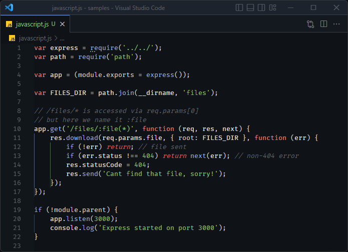

### React

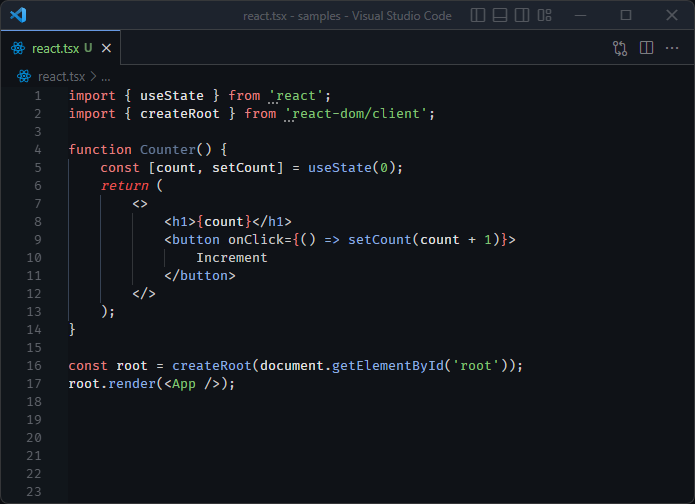

### Ejs

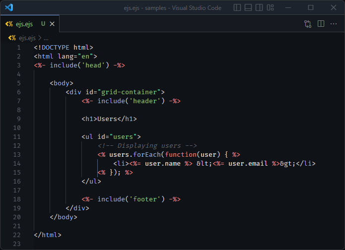

### CSS / Sass

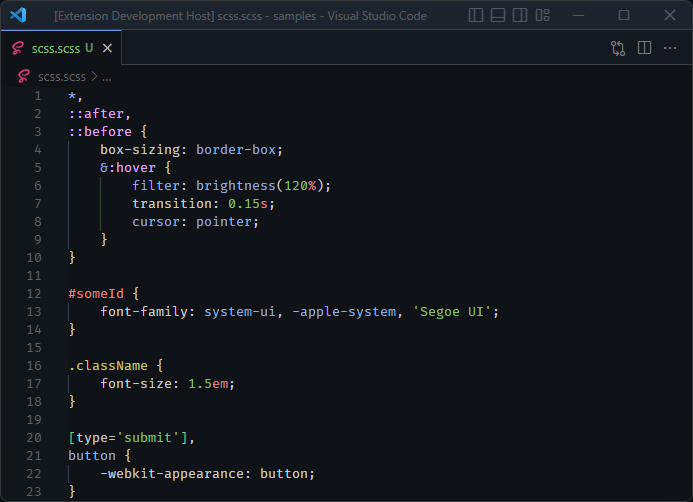

### Python

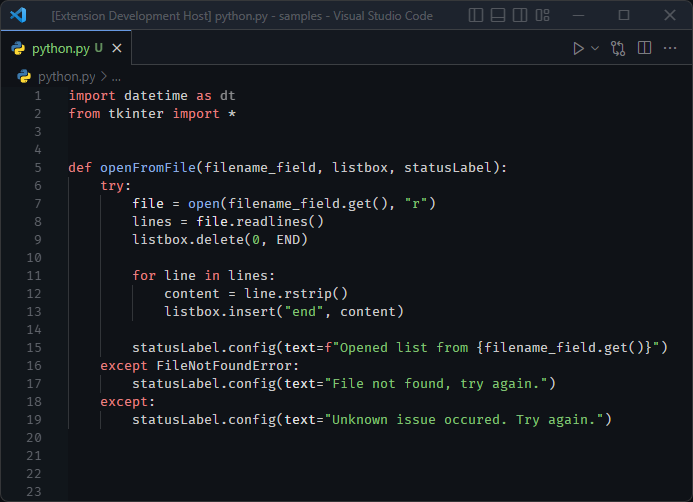

### C# (C Sharp)

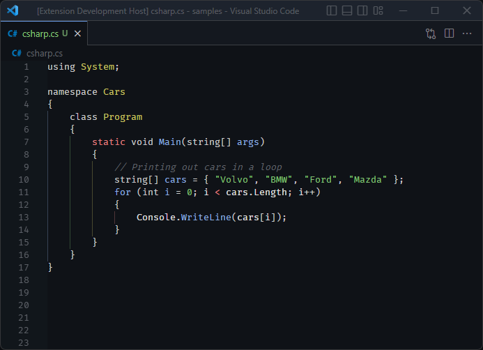

### Markdown

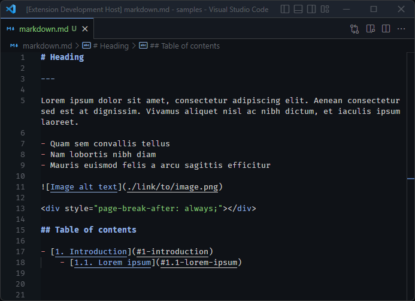

### JSON

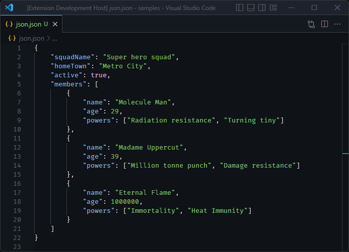

The font used in screenshots is [Fira Code](https://github.com/tonsky/FiraCode).

 

## Colors

### Normal colors

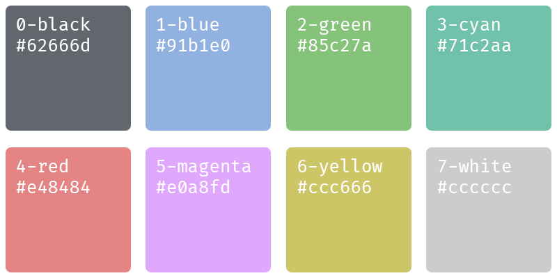

### Bright colors

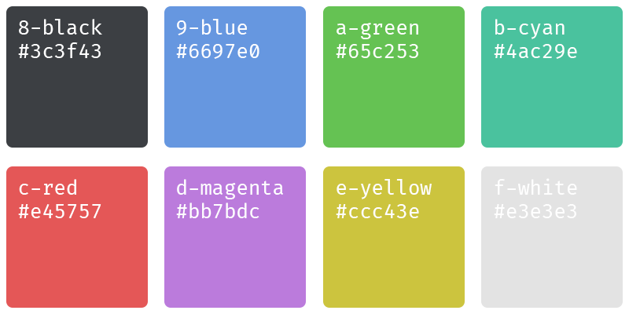

### Other colors

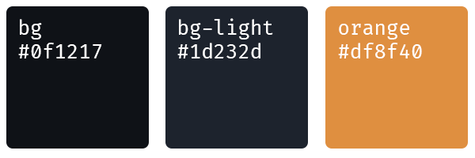

### Color codes

| Name          | Hex     | RGB           |
| ------------- | ------- | ------------- |
| bg            | #0f1217 | 15, 18, 23    |
| bg-lighter    | #1d232d | 29, 35, 45    |
| 0-black       | #62666d | 98, 102, 109  |
| 1-blue        | #91b1e0 | 145, 177, 244 |
| 2-green       | #85c27a | 133, 194, 122 |
| 3-cyan        | #71c2aa | 113, 194, 170 |
| 4-red         | #e48484 | 228, 132, 132 |
| 5-magenta     | #e0a8fd | 224, 168, 253 |
| 6-yellow      | #ccc666 | 204, 198, 102 |
| 7-white       | #cccccc | 204, 204, 204 |
| 8-black       | #3c3f43 | 60, 63, 67    |
| 9-blue        | #6697e0 | 102, 151, 224 |
| a-green       | #65c253 | 101, 194, 83  |
| b-cyan        | #4ac29e | 74, 194, 158  |
| c-red         | #e45757 | 228, 87, 87   |
| d-magenta     | #bb7bdc | 187, 123, 220 |
| e-yellow      | #ccc43e | 204, 196, 62  |
| f-white       | #e3e3e3 | 227, 227, 227 |
| accent-orange | #df8f40 | 223, 143, 64  |
